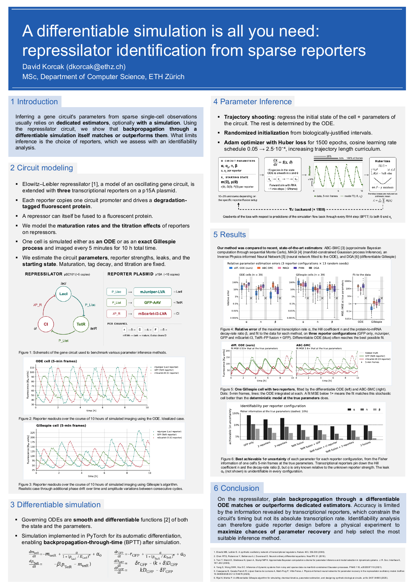
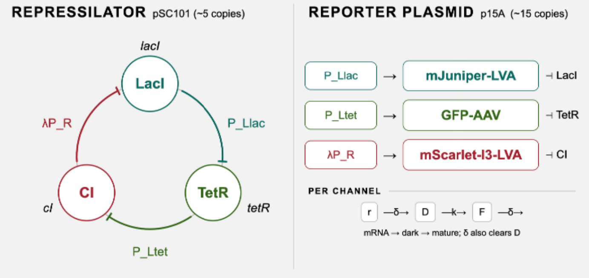
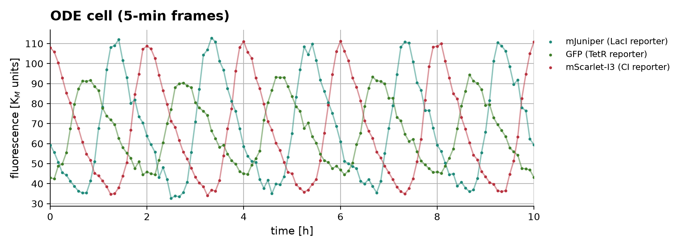
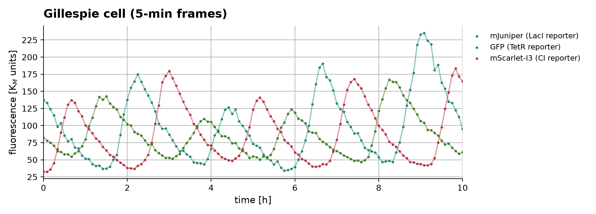
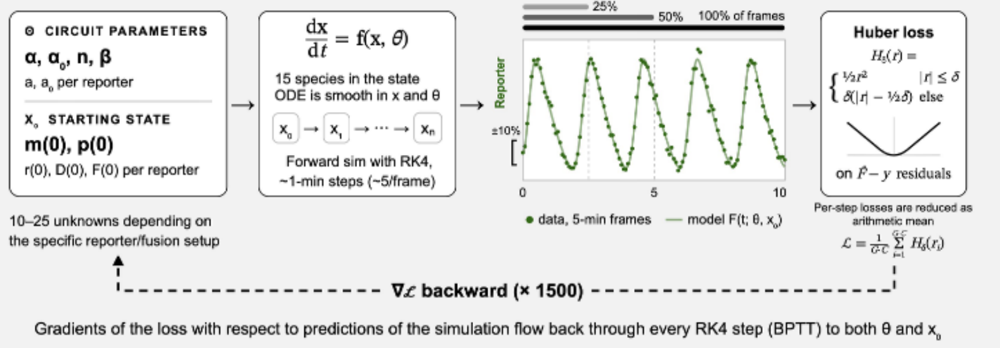
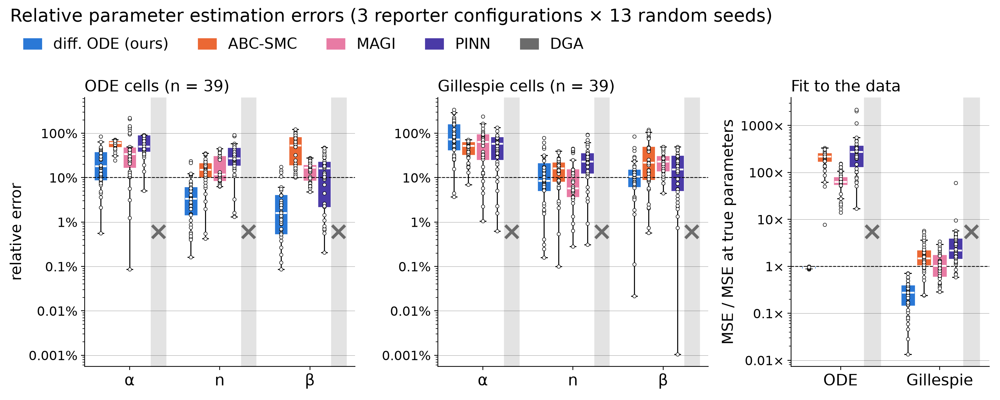
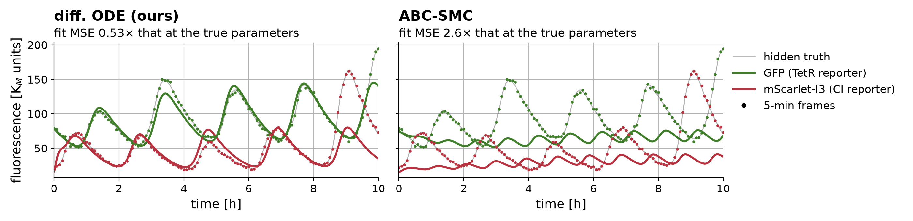
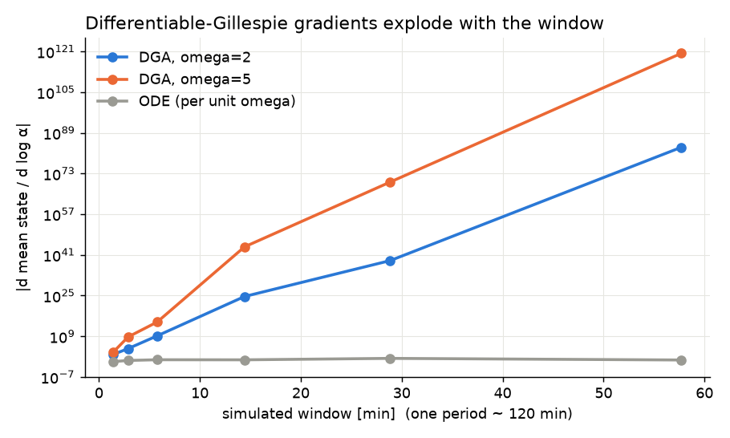
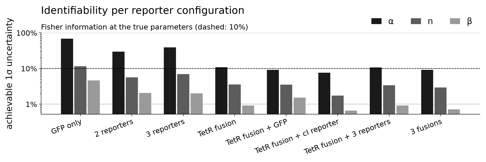
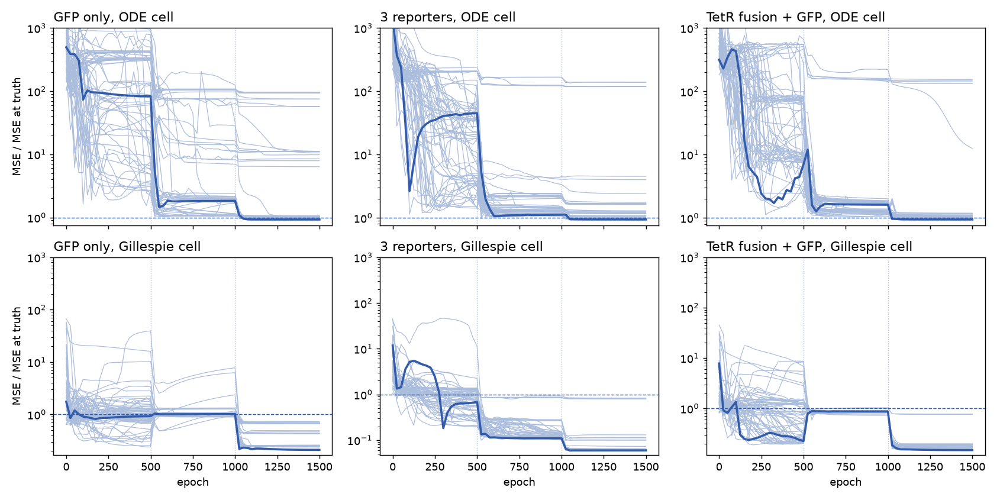

# A differentiable simulation is all you need for repressilator identification from sparse reporters

David Korcak (dkorcak@ethz.ch) · MSc, Department of Computer Science, ETH Zürich

Inferring a gene circuit's parameters from sparse single-cell observations usually
relies on dedicated estimators, optionally with a simulation. Using the repressilator,
we show that **backpropagation through a differentiable simulation itself matches or
outperforms them**. What limits inference is the choice of reporters, which we assess
with an identifiability analysis.

<p align="center"><a href="docs/poster.pdf"></a></p>

## Contents

1. [The circuit and its model](#1-the-circuit-and-its-model)
2. [Making the simulation differentiable](#2-making-the-simulation-differentiable)
3. [Fitting the parameters](#3-fitting-the-parameters)
4. [Results](#4-results)
5. [Side experiments](#5-side-experiments)
6. [Limitations](#6-limitations)
7. [Reproducing](#7-reproducing)
8. [References](#8-references)

---

## 1. The circuit and its model

<p align="center"></p>

### The repressilator

The repressilator was built by Elowitz and Leibler [1]. It consists of three genes on a
plasmid pSC101. Each gene makes a *repressor*, a protein that sits on the start of another gene (its
*promoter*) and stops that gene from being read. LacI represses *tetR*, TetR represses
*cI*, and CI represses *lacI*.

Because the three repressors form a ring, they chase each other. When LacI is high, TetR
falls. Low TetR lets CI rise, and high CI pushes LacI down again. The levels therefore
go round and round, and the cell oscillates with a period of about two hours.

We use the symmetric model from Box 1 of the original paper, in which all three genes
share the same parameter values α = 216, α₀ = 0.216, n = 2 and β = 0.2. Their meaning is
explained with the equations below.

### Reporters

To see what the circuit is doing we add
three *transcriptional reporters* on a second plasmid (p15A). Each reporter is a copy of
one of the circuit's promoters placed in front of a fluorescent protein, so it glows
whenever that promoter is switched on.

| reporter promoter | switched off by | fluorescent protein | maturation half-time | degradation tag (half-life) |
|---|---|---|---|---|
| P_Llac | LacI | mJuniper | 1.7 min | LVA (40 min) |
| P_Ltet | TetR | GFP | 4.1 min | AAV (60 min) |
| λP_R | CI | mScarlet-I3 | 2.0 min | LVA (40 min) |

The degradation tags LVA and AAV are short protein tails that make the cell destroy the
fluorescent protein quickly. Without them the glow would just pile up and hide the
oscillation.

A reporter does not light up instantly. Its gene is first copied into mRNA (r), the mRNA
is translated into a protein that starts out dark (D), and the dark protein then folds
into its glowing form (F). This folding step is called *maturation*. The maturation rates
k come from FPbase and the tag half-lives δ come from Andersen et al. (1998).

Two more details complete the model.

- **Titration.** The reporter promoters carry the same binding sites (operators) as the
  circuit promoters, so they soak up some of their repressor like a sponge. We model this
  as a fixed shift of the repression threshold, K = 1 + τ with τ = 0.75, applied to every
  promoter that the repressor controls.
- **Fusions (optional).** A repressor can itself be fused to a fluorescent protein. Then
  the repressor glows and its level can be read directly instead of through a reporter.
  We treat the fusion as idealised, meaning it does not change how the circuit behaves.

Altogether the model tracks 15 quantities, called *species*. These are the 3 circuit
mRNAs, the 3 repressors, and r, D and F for each of the three reporters. Time is measured
in mRNA lifetimes (one unit is 2.885 min), and protein amounts are measured in units of
K_M, the amount of repressor that half-represses its promoter. This nondimensionalisation
reduces the symmetric circuit to the four numbers α, α₀, n and β.

### The equations

The model is a set of *ordinary differential equations* (ODEs). Each equation says how
fast one amount changes, given the current amounts of everything else. Here is one
repressor pair together with the GFP reporter that watches it.

$$
\frac{dm_{\text{tetR}}}{dt} = -m_{\text{tetR}} + \frac{\alpha}{1 + (p_{\text{LacI}}/K_{\text{LacI}})^{n}} + \alpha_0,
\qquad
\frac{dp_{\text{TetR}}}{dt} = -\beta\,(p_{\text{TetR}} - m_{\text{tetR}})
$$

$$
\frac{dr_{\text{GFP}}}{dt} = -r_{\text{GFP}} + \frac{a}{1 + (p_{\text{TetR}}/K_{\text{TetR}})^{n}} + a_0,
\qquad
\frac{dD_{\text{GFP}}}{dt} = \delta\, r_{\text{GFP}} - (k + \delta)\, D_{\text{GFP}},
\qquad
\frac{dF_{\text{GFP}}}{dt} = k\, D_{\text{GFP}} - \delta\, F_{\text{GFP}}
$$

In words, *tetR* mRNA decays steadily and is produced quickly (rate α) when LacI is
scarce. As LacI builds up, production drops towards a small leak α₀. The Hill
coefficient n sets how switch-like that drop is. The TetR protein follows its mRNA with a
delay set by β. The reporter works the same way, with its own strength a and leak a₀.
Its dark protein D is made from r and matures into F at rate k, and both forms are
destroyed at the tag's rate δ.

| symbol | meaning |
|---|---|
| α, α₀ | maximal (fully unrepressed) and leaky transcription rate |
| n | Hill coefficient of repression, i.e. how sharp the on/off switch is |
| β | ratio of the protein decay rate to the mRNA decay rate |
| a, a₀ | reporter strength and leak |

### Simulated cells

We simulate a cell in two ways.

- **ODE cells** treat every amount as a smooth, continuous number. This gives an
  idealised, perfectly regular cell. We solve it with torchdiffeq's `dopri5` solver at a
  relative tolerance of 10⁻⁸, which is very accurate.
- **Gillespie cells** are closer to reality. A real cell holds only tens of copies of
  each molecule, so reactions happen as separate random events. The Gillespie algorithm
  (also called the stochastic simulation algorithm, SSA) simulates exactly this. It
  repeatedly draws at random which reaction happens next and when, with the correct
  probabilities. The network has 30 reactions. Proteins are counted in units of
  Ω = K_M = 40 molecules, circuit mRNAs in units of Ωβ/e and reporter mRNAs in units of
  Ωδ/e, where e is the number of proteins made per transcript. With these scales the
  drift of the reaction network, divided by the scales, equals the ODE right-hand side
  exactly, and a test checks this. Relative fluctuations scale as 1/√(copy number), so
  tens of molecules give strong intrinsic noise. On a limit cycle this noise appears
  mostly as phase diffusion, which lets the cell drift out of sync with any deterministic
  trajectory, and as variation in amplitude from one cycle to the next.

### Simulated microscope

Cells are simulated at full resolution (every 30 s) and imaged every 5 min for 10 h. The
camera model adds the noise of a real microscope. Photons arrive randomly (Poisson
noise), each fluorophore has its own brightness taken from FPbase, and the camera has a
gain of 2, an offset of 100 and a read noise of 5. The images are then calibrated back
into model units.

<table><tr>
<td></td>
<td></td>
</tr><tr>
<td align="center"><sub>ODE cell. Idealised and perfectly regular.</sub></td>
<td align="center"><sub>Gillespie cell. The timing drifts and each cycle has a different height.</sub></td>
</tr></table>

The model and reaction network are in [`reporters.py`](src/differentiable_cell/reporters.py).
Cells, the camera and frames are in [`reporter_sim.py`](src/differentiable_cell/reporter_sim.py).
The exact SSA and the differentiable Gillespie are in
[`gillespie.py`](src/differentiable_cell/gillespie.py).

## 2. Making the simulation differentiable

To improve a guess of the parameters we need to know in which direction to nudge each
one so that the simulated traces move closer to the data. That direction is the
*gradient* of the mismatch with respect to the parameters.

The right-hand side of the ODE is a smooth function of both the state and the
parameters. So every step of the numerical solver is differentiable, and automatic
differentiation in PyTorch can carry derivatives backwards through all the steps. This
is called backpropagation through time (BPTT), the same technique used to train
recurrent neural networks. The simulation is written in PyTorch and integrated with
torchdiffeq [2].

We discretise first and then optimise. The gradients are the exact gradients of the
discrete RK4 map, obtained by reverse-mode autodiff through all ~600 solver steps, not by
the continuous adjoint method. At this horizon and batch size (64 restarts, ~600 steps,
at most 15 states) storing the computation graph is cheap, and it avoids the adjoint's
backward re-integration error on an oscillator.

For fitting we use a fixed-step RK4 solver with a step of 0.35 model units (about 1 min,
roughly 5 steps per frame). The data are generated with adaptive `dopri5` at a relative
tolerance of 10⁻⁸. Solver error therefore ends up inside the misfit, and we avoid the
"inverse crime" of fitting data produced by the same discretisation.

## 3. Fitting the parameters

<p align="center"></p>

Each cell is an initial value problem ẋ = f(x, θ) with x ∈ ℝ^(6+3R) for R reporters. We
observe G frames (every 5 min for 10 h) of C channels, y_{g,c} = h_c(x(t_g)) + ε_{g,c},
where h_c reads off a reporter's mature fluorophore F or a fused repressor. The unknowns
are the kinetic parameters θ and the initial condition x₀, so the estimator is
(θ̂, x̂₀) = argmin L(θ, x₀) over a box. At the Box 1 parameters the system sits on a
stable limit cycle, so x₀ mostly encodes the cell's phase, and phase is a neutral
direction of the dynamics. That is why x₀ has to be estimated jointly rather than fixed.

### What is unknown

We use *trajectory shooting*. We guess everything the simulation needs to start, run it
forward, compare it with the data, and improve the guess. The unknowns are

- the circuit parameters α, α₀, n and β,
- the strength a and leak a₀ of each reporter that is built,
- the cell's **full starting state**, i.e. the amount of every species at t = 0. We do
  not know where in its cycle the cell was when filming began.

That makes 10 + 5R unknowns for R reporters, so between 10 and 25 in total. Everything
after t = 0 then follows from the ODE. Maturation, tag decay and titration are treated as
known and fixed.

### Where the guesses start

Every unknown starts at a random value inside a box of physically sensible values. The
value is drawn log-uniformly, so every order of magnitude in the box is equally likely.

- α between 20 and 1000
- α₀ between 10⁻³ and 1
- n between 1 and 4
- β between 0.1 and 1

For a species that is measured, the starting value is boxed to its first frame ± 10% of
that channel's range. This pins down where in its cycle the cell starts. Hidden species
are free within their box.

Every unknown is optimised in log space through θ = lo + σ(z)(hi − lo), with z
unconstrained and σ the logistic function. The box is enforced exactly, without
projection or penalty. Working in log space also puts relative errors on a common scale,
which matters when α and α₀ differ by three orders of magnitude.

### Loss function

At every frame we take the residual r = (F̂ − y) / range(y), the simulated glow F̂ minus the
measured glow y, divided by that channel's range so that bright and dim channels count
equally. We then apply the Huber loss with δ = 0.05 (this δ is unrelated to the tag
decay rate). Huber behaves like the squared error for small residuals and like the
absolute error for large ones, so a few large mismatches cannot dominate. The loss is
the plain average over all G·C data points (G frames times C channels).

$$\mathcal{L} = \frac{1}{G\cdot C}\sum_{i=1}^{G\cdot C} H_\delta(r_i)$$

### Optimisation

- We use Adam for 1500 epochs (update steps), and the learning rate (step
  size) follows a cosine curve from 0.05 down to 2.5·10⁻⁴.
- We use a *curriculum*. The loss first sees only the first 25% of the frames, then the
  first 50%, then all of them. On a limit cycle a period error ΔT turns into a phase
  error that grows linearly in time, roughly tΔT/T. Over the full 10 h a modest period
  mismatch shifts the trajectory by whole cycles. The misfit then becomes nearly flat in
  the parameters and has spurious minima wherever the model runs a cycle ahead or
  behind. Fitting the first quarter and half of the record pins the period while phase
  errors are still small, and the full record then refines it.

### Restarts

Gradient descent only finds the bottom of the valley it starts in, and the loss has many
valleys. So we draw 64 random starting guesses and optimise them all in parallel as one
batch. The restart with the lowest plain mean squared error (MSE) over the full record is
our estimate.

## 4. Results

### 4.1 Against dedicated estimators

We compare our approach with three established methods.

- **ABC-SMC** [3] (approximate Bayesian computation with sequential Monte Carlo) never
  writes down how likely the data are. It draws many parameter sets, simulates each one,
  and keeps those whose simulations land within a tolerance of the data. It tightens the
  tolerance over several rounds. It uses 500 particles (candidate parameter sets) and up
  to 300k simulations, and its estimate is the weighted median of the final particles.
- **MAGI** [4] (MAnifold-constrained Gaussian process Inference) never runs a solver. It
  describes each trajectory as a smooth random curve (a Gaussian process) and asks the
  curve to fit the data and to satisfy the ODE at the same time. It then finds the most
  probable parameters (a MAP estimate) and samples around them with NUTS, preconditioned
  with the Hessian. NUTS, the No-U-Turn Sampler, is a standard method for drawing samples
  from a posterior distribution.
- **Inverse PINN** [5] (physics-informed neural network) represents the trajectory with a
  neural network of 5 layers of 100 units with sine activations. The network is trained
  to fit the data and to make the ODE residual small.
- **Differentiable Gillespie (DGA)** [6] did not qualify (see §4.3).

All methods see the same cells, the same frames and the same prior boxes. There are three
reporter configurations.

1. GFP only
2. mJuniper, GFP and mScarlet-I3
3. a TetR fusion plus GFP

Each configuration is run with **13 random seeds** on both ODE and Gillespie cells, which
gives 39 cells per method and cell type. A seed fixes where in its cycle the cell starts,
the random path of a Gillespie cell, and the camera noise.

<p align="center"></p>

Parameter errors are relative errors against the true value. The fit panel shows how well
each estimate reproduces the data. We integrate the ODE at the estimated parameters,
compute its MSE against the data, and divide by the MSE obtained with the true
parameters. On ODE cells, 1× is the best fit the data allow.

Median results on **ODE cells**

| method | α | n | β | fit (× MSE at truth) |
|---|---|---|---|---|
| **diff. ODE (ours)** | **18%** | **3.4%** | **1.6%** | **0.94×** (all 39 between 0.87× and 1.0×) |
| ABC-SMC | 61% | 15% | 54% | 219× |
| MAGI | 34% | 12% | 17% | 64× |
| inverse PINN | 50% | 28% | 16% | 278× |

Median results on **Gillespie cells**

| method | α | n | β | fit (× MSE at truth) |
|---|---|---|---|---|
| **diff. ODE (ours)** | 73% | 8.5% | **11%** | **0.28×** |
| ABC-SMC | 53% | 16% | 22% | 1.5× |
| MAGI (37 of 39, 2 failed with NaN) | 64% | **5.8%** | 23% | 1.04× |
| inverse PINN | 58% | 23% | 16% | 2.2× |

**On ODE cells ours is best on every parameter**, and it is the only method that reaches
the optimum. The other methods' estimates reproduce the data 64 to 278 times worse.

- MAGI and the PINN are both gradient-matching (collocation) methods. They enforce the
  ODE only as a soft penalty at collocation points and trade the data fit against the
  ODE residual. A small residual at every point still allows slow phase drift, so their
  trajectories are not ODE solutions, and their estimates refit poorly once the ODE is
  actually integrated.
- For ABC-SMC the acceptance rate falls roughly exponentially with the dimension of what
  must match, here 10 to 25 unknowns and a few hundred data points. Within 300k
  simulations the tolerance never gets small enough to separate the posterior from a
  broad shell around the data.

**On Gillespie cells the picture is mixed.**

- Ours gives the best β and by far the closest fit.
- MAGI estimates n better.
- No method recovers α. The random variation in height from one cycle to the next
  swamps α, which is exactly the parameter that sets the height. Our per-cell α errors
  range from 4% to 341%.
- Fits below 1× are expected here. A deterministic model run at the true parameters
  cannot follow the random path of a stochastic cell, so a fitted model can do better.

**The number of seeds matters.** With only the first 3 seeds we looked better on
Gillespie cells than we do with 13 (α 52% instead of 73%, n 5.5% instead of 8.5%). The
result on ODE cells did not change.

### 4.2 What the difference looks like

<p align="center"></p>

This is one Gillespie cell with two reporters (seed 1). Of the three seeds available for
this configuration it is the median case for ABC-SMC, not the most flattering contrast.
Both methods started from the same prior draws, since ABC's first 64 particles are
exactly our 64 starting guesses.

- Ours follows the timing and height of each cycle, at 0.53× the MSE at the truth.
- ABC-SMC settles on small, fast oscillations, at 2.6×.

### 4.3 Differentiable Gillespie does not qualify

A Gillespie simulation makes hard, discrete choices (which reaction fires next), so it
has no gradient. The differentiable Gillespie algorithm (DGA) of Rijal and Mehta [6]
replaces these choices with smooth approximations controlled by two widths a and b,
which makes gradients exist. We checked whether those gradients are usable.

<p align="center"></p>

The figure and table show |d mean state / d log α|, how much the average state moves when
α is nudged. It is averaged over 8 cells on the three-reporter model at the paper's
smoothing (1/a = 200, 1/b = 20).

| simulated window | 1.4 min | 2.9 min | 5.8 min | 14 min | 29 min | 58 min |
|---|---|---|---|---|---|---|
| DGA, Ω = 2 | 8·10¹ | 1·10⁴ | 1·10⁹ | 4·10²⁴ | 6·10³⁸ | **2·10⁸³** |
| DGA, Ω = 5 | 8·10² | 5·10⁸ | 4·10¹⁴ | 1·10⁴⁴ | 4·10⁶⁹ | **2·10¹²⁰** |
| ODE, same quantity | 0.1 | 0.3 | 0.6 | 0.6 | 2.1 | 0.5 |

The ODE sensitivity stays O(1), while the DGA gradient explodes within an hour, which is
less than one period. The DGA gradient is a product of per-event Jacobians over about 10⁴
events per period (a period is about 120 min). The smoothed update mixes in the
stoichiometries of neighbouring reactions through a Gaussian kernel of width b, so each
event amplifies perturbations a little. In a feedback loop these factors compound, and
the gradient grows roughly exponentially with the window length (from 6·10³⁸ to 2·10⁸³
between 29 and 58 min at Ω = 2).

This does not contradict Rijal and Mehta [6]. They fit steady-state *averages*
(moments) over thousands of cells, for a promoter without feedback, and they point out
that time series that are not in steady state are untested. A single oscillating cell is
exactly that untested case.

### 4.4 Identifiability. The reporters set the limit

Some parameters cannot be pinned down from a given set of measurements, however good the
method is, because quite different values produce almost the same traces. This is called
poor *identifiability*. We can compute the best accuracy any method could reach.

<p align="center"></p>

The plot shows the best achievable 1σ uncertainty of each parameter for each
configuration. It comes from the *Fisher information*, which measures how strongly the
frames of one cell change when a parameter changes, evaluated at the true parameters.
The more the data react to a parameter, the more precisely that parameter can be known.
The unknown starting state is profiled out (with a Schur complement), which accounts for
having to estimate it as well, and the prior box is included.

- **Transcriptional reporters** show *when* promoters switch on and off, and that pins
  down n and β. They do not show *how strongly* the repressor levels swing. α is only
  known relative to the unknown reporter strength a, because a stronger circuit seen
  through a weaker reporter looks the same.
- **A fused repressor** shows its own absolute level, which brings α to about 10%.
- **The leak α₀** cannot be identified in any configuration (43% to 192%, not shown).

Our achieved errors on ODE cells (median over the available seeds) are at or close to
these bounds. **The fit extracts what the data contain**, and the remaining error is set
by what is measured.

| configuration | seeds | achieved α / n / β | achievable 1σ α / n / β |
|---|---|---|---|
| GFP only | 14 | 37% / 6.4% / 5.3% | 69% / 11.6% / 4.6% |
| 2 reporters (GFP + mScarlet-I3) | 3 | 10% / 2.8% / 0.6% | 30% / 5.7% / 2.1% |
| 3 reporters | 14 | 30% / 2.9% / 1.6% | 39% / 7.0% / 2.0% |
| TetR fusion | 3 | 11% / 3.4% / 0.3% | 11% / 3.6% / 0.9% |
| TetR fusion + GFP | 13 | 9% / 2.0% / 0.7% | 9% / 3.5% / 1.5% |
| TetR fusion + mScarlet-I3 | 3 | 7% / 0.4% / 0.5% | 8% / 1.7% / 0.7% |
| TetR fusion + 3 reporters | 3 | 6% / 2.1% / 0.9% | 11% / 3.4% / 0.9% |
| 3 fusions | 3 | 2% / 1.4% / 0.6% | 9% / 3.0% / 0.7% |

### Conclusion

On the repressilator, plain backpropagation through a differentiable ODE matches or
beats dedicated estimators. Accuracy is limited by the information the reporters reveal.
Transcriptional reporters constrain the circuit's timing but not its absolute
transcription rate. An identifiability analysis can therefore guide reporter design
before a real experiment, both to maximise the chance of recovering the parameters and
to choose a suitable inference method.

## 5. Side experiments

These experiments shaped the final settings. None of them changes the conclusions.

### Tuning the loss and optimiser

See [`tuning.py`](experiments/tuning.py). This used 6 datasets (3 configurations times
2 seeds, ODE cells) at a reduced budget of 32 restarts and 1000 epochs. Variants were
judged on how well they fit the data, never on their errors against the true values.

| variant | median fit / truth MSE | reached optimum | α / n / β |
|---|---|---|---|
| MSE + exponential lr (baseline) | 1.097 | 3/6 | 42 / 9.1 / 3.9% |
| Huber + exponential lr | 0.968 | 5/6 | 11 / 7.5 / 2.4% |
| MSE + cosine lr | 0.981 | 5/6 | 40 / 9.2 / 3.6% |
| **Huber + cosine lr (used)** | **0.940** | **6/6** | 33 / 13 / 2.9% |
| RMSprop | 1.228 | 0/6 | 31 / 19 / 11% |
| SGD + Nesterov | 5.70 | 0/6 | 81 / 47 / 36% |

Huber mainly helps the *optimisation*, because it caps the gradient coming from the
large residuals early in a fit. It is not a better model of camera noise, for which MSE
is the correct likelihood. Once a fit reaches the optimum, the parameter errors are set
by the data (§4.4), not by the loss.

### How the 64 restarts spread

See [`restart_spread.py`](experiments/restart_spread.py). This recorded every restart's
loss over the full record every 25 epochs.

<p align="center"></p>

- About half the restarts reach the optimum on ODE cells (24 to 32 of 64). The rest get
  stuck on flat plateaus (local minima) from about epoch 500 on. These are consistent
  with phase-slip minima, fits that run a cycle ahead or behind. More restarts protect
  against this, more epochs do not.
- **Restarts that reach the same optimum disagree on α.** On configurations with
  reporters only, α errors range from 2% to 65% at equally good fits. This is the sloppy
  direction of §4.4 observed empirically. With the fusion configuration the restarts
  agree (5% to 31%).
- The best fit settles within about 100 epochs of the curriculum reaching the full
  record (around epoch 1100). The last ~400 epochs change the MSE by less than 0.3%.
- **The schedule cannot simply be shortened.**
  - With 600 epochs the optimum is still reached, but only by 3 to 10 of 64 restarts
    instead of 24 to 32. The early stages decide how many restarts escape bad valleys.
  - Lowering the final learning rate to 10⁻⁵ instead of 2.5·10⁻⁴ changes nothing at
    either length.
  - So the setup stays at 1500 epochs.

## 6. Limitations

- **The data are synthetic and the model structure is known.** The same equations
  generate and fit the ODE cells. Gillespie cells are misspecified for every method.
- **Only one parameter set** (Box 1) was tested.
- **Seeds.** The three benchmark configurations use 13 seeds. The 20-seed run was stopped
  at the last seed that was complete for every method on both cell types. The other five
  configurations use 3 seeds.
- **Some model details are idealised.** Fusions do not perturb the circuit, and
  titration is a fixed effective shift.
- **ABC-SMC is limited by its budget** of 300k simulations. A larger budget would help
  it, and we did not measure by how much.
- **Run time is not a claim.** Methods ran on fixed budgets, not until convergence. Ours
  took about 10 min per cell (64 restarts), ABC about 4 min, MAGI about 10 min and the
  PINN about 12 min.

## 7. Reproducing

```bash
uv sync
uv run pytest tests -q                                   # all tests

# the benchmark (resumable; one JSON per fit in run_results/panel_benchmark/<method>/)
uv run python experiments/panel_benchmark.py --method gradient,abc,magi,pinn --seeds 20 --workers 5 --threads 2
uv run python experiments/panel_benchmark.py --method gradient,abc --workers 3   # all 8 configurations, 3 seeds

# figures (run_results/figures/)
uv run python experiments/plot_results.py                # results_main: seeds complete for every method on both cell types
uv run python experiments/plot_fit_comparison.py
uv run python experiments/plot_identifiability.py        # add --replot to restyle without recomputing
uv run python experiments/poster_sim_plots.py
uv run python experiments/dga_gradient_growth.py

# side experiments
uv run python experiments/tuning.py --workers 3 && uv run python experiments/tuning.py --report
uv run python experiments/restart_spread.py --workers 3 && uv run python experiments/restart_spread.py --report
uv run python experiments/restart_spread.py --workers 3 --epochs 600 --lr-final 1e-5
```

## 8. References

1. Elowitz MB, Leibler S. A synthetic oscillatory network of transcriptional regulators.
   *Nature* 403, 335–338 (2000).
2. Chen RTQ, Rubanova Y, Bettencourt J, Duvenaud D. Neural ordinary differential
   equations. *NeurIPS* 31 (2018).
3. Toni T, Welch D, Strelkowa N, Ipsen A, Stumpf MPH. Approximate Bayesian computation
   scheme for parameter inference and model selection in dynamical systems.
   *J. R. Soc. Interface* 6, 187–202 (2009).
4. Yang S, Wong SWK, Kou SC. Inference of dynamic systems from noisy and sparse data via
   manifold-constrained Gaussian processes. *PNAS* 118, e2020397118 (2021).
5. Casajuana B, Casals-Franch R, López García de Lomana A, Martí-Puig P, Villà-Freixa J.
   Physics-informed neural networks for parameter recovery in the repressilator
   oscillatory model. *bioRxiv* 10.64898/2026.05.12.724679 (2026).
6. Rijal K, Mehta P. A differentiable Gillespie algorithm for simulating chemical
   kinetics, parameter estimation, and designing synthetic biological circuits.
   *arXiv* 2407.04865 (2025).

Maturation rates and brightness values come from FPbase (Lambert, *Nat. Methods* 16,
277–278, 2019). Degradation-tag half-lives come from Andersen et al.,
*Appl. Environ. Microbiol.* 64, 2240–2246 (1998).
