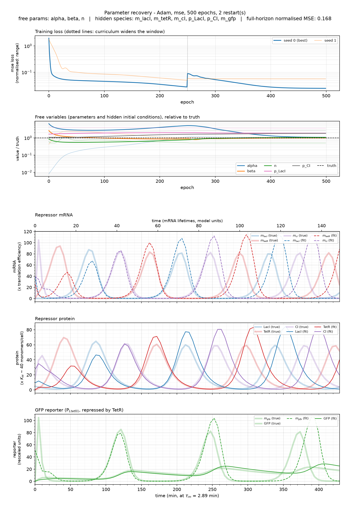

# Practical identifiability of the repressilator from sparse partial observations: a differentiable-simulation analysis of reporter selection

> **Work in progress.** This README is the running report. Every number in
> section 3 is measured here and reproducible with `experiment_scripts/`;
> section 5 records what the question still needs.

## Abstract

The repressilator remains a canonical testbed for inference in synthetic gene
circuits. In an experimental setting, a critical question arises: which
fluorescent reporter should be built, and does one suffice? Previous
repressilator inference studies have used likelihood-free Bayesian simulation,
nested Bayesian inference, Gaussian-process manifold constraints, and,
recently, inverse physics-informed neural networks. These methods establish
parameter recovery under selected observation regimes but do not formulate
reporter selection through gradients of an explicit mechanistic forward
simulator. We differentiate the reporter-observation objective through the
repressilator ODE solution, enabling direct sensitivity analysis and
optimization over feasible measurement designs.

We implement the repressilator as a differentiable simulator with an explicit
reporter arm and pose the inverse problem by masking parameters and species:
each hidden species contributes its initial value as a free variable, recovered
jointly with the free parameters by gradient descent through the solver.
Reporter panels are screened at matched cadence and noise.

We ask, for a fixed observation budget, which one- or two-reporter subsets of
the repressilator state permit practical recovery of each kinetic parameter or
identifiable parameter combination, and how those conclusions change under
finite sampling, measurement noise and stochastic data generation. Early
results indicate that recoverability is governed by what is measured, not by
how well it is fitted. The obstacles are weakly constrained latent initial
conditions, multimodal objectives whose optima disagree at comparable loss, and
phase decoherence over long horizons; additional channels, controlled
perturbations and combination-level diagnostics are the routes we pursue.

## 1. The question

An experimentalist building a repressilator strain chooses a **measurement
design** before any data exists: which species carry a fluorophore, at what
imaging cadence, at what signal-to-noise. That choice decides which parameters
the experiment can ever determine. We treat it as the design variable.

> Given a fixed observation budget, which one- or two-reporter subsets of the
> repressilator state yield practical recovery of each kinetic parameter or
> identifiable parameter combination, and how do those conclusions change under
> finite sampling, measurement noise, and stochastic data generation?

Three axes, one flag each: the **subset** (`--drop_state`), the **cadence**
(`--sample_hz`), the **noise** (`--noise`). The four *canonical* parameters are
the network's own - `alpha` (transcriptional gain), `alpha_0` (leakiness), `n`
(cooperativity), `beta` (protein-to-mRNA decay ratio); `alpha_GFP` and
`beta_GFP` describe the measurement device, not the circuit.

## 2. Model and method

The repressilator (Elowitz & Leibler, *Nature* **403**, 335-338, 2000) is a
cyclic negative-feedback loop, `LacI --| tetR -> TetR --| cI -> CI --| lacI`.
We integrate the dimensionless model of its Box 1, extended with the GFP
reporter the experiment observes:

```
dm_i/dt = -m_i + alpha / (1 + p_j**n) + alpha_0
dp_i/dt = -beta * (p_i - m_i)
```

Eight states, six parameters, time in mRNA lifetimes (`tau_m = 2.885 min`),
protein in units of `K_M ~ 40 monomers/cell`. At the paper's kinetics this
gives `alpha = 216` - reproduced as a unit check in the code - and a period of
127 min against the 160 +/- 40 min measured in single cells.

The inverse problem is posed by shooting: integrate from an initial state and
compare against the observed species. **A hidden species contributes exactly
one unknown, its value at `t = 0`**; the ODE supplies the rest of its
trajectory. Four choices are load-bearing:

- **Log-space parameters** - raw gradients span ~2900x across the six
  parameters, so no single learning rate works; log space narrows this to ~470x
  and guarantees positivity.
- **A growing horizon** - section 4.
- **Per-species loss normalisation** - mRNA spans 0-125 while GFP spans 0-25,
  so an unnormalised loss barely sees the reporter, the one species actually
  observable.
- **Biologically bounded priors** - `alpha` in (1, 2000) is 40 to 80,000
  copies/cell; `beta` in (0.03, 2) is a protein half-life of 67 down to 1 min.

## 3. Results

### 3.1 A partially observed case



Two of eight species observed - a TetR-fluorophore fusion and the GFP reporter -
with the other six hidden, each contributing its initial value as an unknown:
nine free variables against 86 frames at one every five minutes, with 1%
measurement noise. The kinetic parameters come back close, `alpha` to 7.9% and
`beta` to 1.5%, but the figure shows what the error table does not. The hidden
initial values never converge - `p_LacI(0)` and `p_CI(0)` plateau near twice
their true values in the second panel - and the small residual period error
accumulates into a visible phase offset, so that by the end of the record the
reconstructed oscillation leads the true one by a substantial fraction of a
cycle. The full-horizon error is 0.168 against 0.0028 for the same fit with all
eight species observed, and `n` is not settled at all: the second restart ended
on its prior floor. Close parameters and a wrong trajectory is the characteristic
signature here, and it is why we score panels on restart agreement and
full-record reproduction rather than on the fitted loss.

### 3.2 What is measured decides what is recoverable

At the same cadence and noise, varying only which species are visible:

| reporter panel | `alpha` (216) | `beta` (0.2) | `n` (2) |
|---|---|---|---|
| all 8 species | **2.4%** | **1.1%** | **0.4%** |
| `p_TetR + p_GFP` | 7.9% | 1.5% | n ambiguous |
| 3 repressor fusions | 327% | 23% | 11% |
| `p_GFP` alone | 335% | 51% | 11% |

A single reporter does not determine the network parameters. Adding one
repressor fusion recovers `alpha` and `beta`, though `n` remains unsettled: its
two restarts disagree, one sitting on its prior floor.

**Restart agreement is necessary but not sufficient.** The three-fusion panel is
the cautionary case: both restarts converged to within ~1e-3 of *each other* on
an answer 327% wrong, at a better trajectory fit than the two-channel panel that
got `alpha` right. Confident agreement on a wrong optimum is what a genuinely
degenerate direction looks like, and it is the argument for combination-level
diagnostics rather than restart scatter.

`alpha_0` is unrecoverable at 1% noise (96% error): leakiness contributes ~0.1%
of transcription, well beneath the measurement floor.

## 4. Obstacles

The three named in the abstract, as measured:

**Latent initial conditions are weakly constrained.** Moving `m_cI(0)` from 0 to
50 changes the loss by 1.7e-3, which can be smaller than the fit's own residual;
in the two-channel panel the hidden initial values were not recovered at all
(`m_lacI(0)` fitted to 39.6 against a truth of 0) even where the parameters were.

**Objectives are multimodal.** From GFP alone, independent restarts return
`alpha` of 8, 41 and 44 against a true 216, with losses within 2x of each other.

**Phase decoherence removes the gradient over long horizons.** A small period
error accumulates into a phase flip and the loss saturates:

| horizon | `beta` = 0.19 | 0.20 (truth) | 0.21 |
|---|---|---|---|
| 2.3 periods | 103.9 | 0 | 100.8 |
| 11.3 periods | 815.6 | 0 | 855.3 |

Hidden initial values pull the other way - their influence on the observed
species *grows* with the window - so a curriculum that fits one period and then
widens serves both.

## 5. What the question still needs

| sub-question | evidence | missing |
|---|---|---|
| which **one**-reporter subsets suffice? | one tested (`p_GFP`): insufficient | a screen over reporter targets, fitting all four canonical parameters |
| which **two**-reporter subsets? | one pair tested: `alpha`, `beta` yes, `n` no | a systematic pairwise screen |
| which **combinations** survive when parameters do not? | none | profile likelihood or sensitivity-matrix eigen-decomposition |
| under **finite sampling**? | 5 min and 8.66 s replicated | a cadence sweep at fixed photon budget |
| under **noise**? | one-parameter sweep, sigma <= 0.05 | noise x panel, more restarts |
| under **stochastic data generation**? | none | a Gillespie or chemical-Langevin generator |

Three are code, not compute:

1. **The reporter target is not switchable.** One reporter arm, hard-wired to
   P_Ltet01. Screening *targets* requires choosing which repressor drives it.
2. **Combination-level identifiability needs its own tool** -
   `experiments/identifiability.py` is the starting point.
3. **Stochastic data generation.** `--noise` is an observation-level stand-in,
   not intrinsic reaction noise.

A **controlled perturbation** (the paper's own IPTG control) is a natural fourth
axis with no analogue here - the model has no input term.

At five-minute sampling each fit is 86 frames: a single-reporter screen is ~3 h
and a pairwise screen ~4 h.

## 6. Reproducing

```bash
uv sync
python experiments/run_clean.py --ode --steps 3000 --dt 0.05   # ground truth
./experiment_scripts/01_sanity.sh run_results/<the-directory-it-printed>
```

`run_clean.py` checks at save time that its own log replays to the stored
trajectory (`roundtrip_max_abs_err`, 0.0 in float64), so every experiment is
posed against exactly the forward problem that generated its data.

| | |
|---|---|
| `src/differentiable_cell/` | model, solvers, unit conversions |
| `experiments/run_clean.py` | forward run -> `run_results/<timestamp>_<args>/` |
| `experiments/run_partial.py` | inverse problem |
| `experiment_scripts/` | one script per fixed experiment |

`experiment_scripts/README.md` explains how to read a result - `at_prior_bound`,
`spread_over_restarts` and `full_horizon_normalised_mse` separate a measurement
from an artefact.
